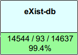

We just reached another milestone in our struggle to make eXist 100% conformant with the XQuery specs: 99.4%! Details can be found on the official [W3C XQuery Test Suite](http://www.w3.org/XML/Query/test-suite/XQTSReportSimple.html) pages.

Recent changes were mostly related to namespace handling, though we also had a number of small fixes to the XQuery parser, including whitespace processing and ordering declarations.

