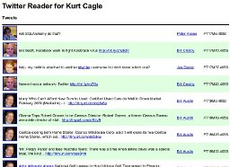

Kurt Cagle today published an article on DevX.com: "[From Social to Serious: Combining Twitter and RESTful Web Services](http://www.devx.com/webdev/Article/41337/0/page/1)". Using the implementation of a twitter reader as an example, the article demonstrates how to build a RESTful data application. It covers many topics along the way, including request routing and XProc.

Note: if you are using the trunk version of eXist, you may want to look at [XQueryURLRewrite](http://atomic.exist-db.org/blogs/eXist/IntroducingXQueryURLRewrite), which is the successor of the RedirectorServlet used by Kurt.
