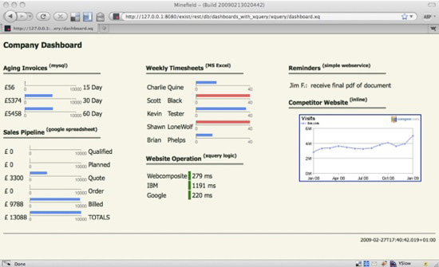

IBM Developerworks today has an article on "[Making Dashboards with XQuery](http://www.ibm.com/developerworks/xml/library/x-xqdashboard/index.html?ca=drs)".

It uses eXist and provides a nice example of how to access external website data to create a mashup in XQuery. Source code is available as a starting point for your own experiments, though it is not optimized for speed in any way. Note: you may want to test this with eXist trunk, not 1.2.5 (processing in-memory fragments works much faster with trunk).

P.S.: also check Chris Wallace's article on "[Dashboards and Widgets in XQuery](http://thewallaceline.blogspot.com/2009/04/dashboards-and-widgets-in-xquery.html)"

