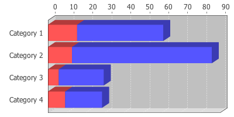
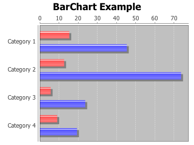
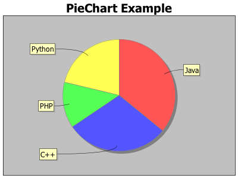

Some time ago two interesting articles have been posted about creating [dashboards](/blogs/eXist/XQueryDashboards) in XQuery. One of the articles makes use of the Google Chart API to render graphs and inspired me to add a charting facility to eXist-db using the [JFreeChart](http://www.jfree.org/jfreechart/) library.

*this article is a reconstruction of an article [originally written on 14 april 2009](http://web.archive.org/web/20090424061937/http://atomic.exist-db.org/blogs/dizzzz/JFreeChart)*

# JFreeChart

## Getting Started

The new module is made available as an extension module and is not built by default. To enable the extension perform the following steps:

- Edit `extensions/build.properties` and follow the instructions
- Change `include.module.jfreechart = false` to true
- Change `include.module.fop = false` to true for SVG support (new)
- Uncomment the module in `conf.xml` (conf.xml.tmpl)
- Run `build.sh`

All required files are downloaded as the module is built. After the build completes the new module's functions are available for use.

## How to use

The module provides two functions:

jfreechart:render($a as xs:string, $b as node(), $c as node()) xs:base64Binary?

This function renders the image into a base64 encoded blob, while -

jfreechart:stream-render($a as xs:string, $b as node(), $c as node()) empty()

renders the image directly to the HTTP response (via. the servlet output stream). This function can only be used in the REST interface.

Both functions accept the same set of parameters: a is the chart type, b are the chart settings and c is the chart data.

### a : chart type

Not all JFreeChart types are available (yet). At present the following charts are available:

*LineChart, LineChart3D, MultiplePieChart, MultiplePieChart3D, PieChart, PieChart3D, RingChart, StackedAreaChart, StackedBarChart, StackedBarChart3D, WaterfallChart*.

### b : chart settings

Parameters are passed as a node, with the element names reflecting the parameters of the original [JFreeChart classes](http://www.jfree.org/jfreechart/api/javadoc/org/jfree/chart/ChartFactory.html):

<table>
<thead>
<tr>
<th>Parameter</th>
<th>Description</th>
<th></th>
</tr>
</thead>
<tbody>
<tr>
<th>categoryAxisColor</th>
<th>the color of the category axis (#)</th>
<th></th>
</tr>
<tr>
<th>categoryAxisLabel</th>
<th>the label for the category axis</th>
<th></th>
</tr>
<tr>
<th>categoryItemLabelGeneratorClass</th>
<th>Set implementing class (see <a href="http://www.jfree.org/jfreechart/api/javadoc/org/jfree/chart/labels/CategoryItemLabelGenerator.html">javadoc</a>) (#)</th>
<th></th>
</tr>
<tr>
<th>categoryItemLabelGeneratorNumberFormat</th>
<th>(see constructors implementing class in <a href="http://www.jfree.org/jfreechart/api/javadoc/org/jfree/chart/labels/CategoryItemLabelGenerator.html">javadoc</a>) (#)</th>
<th></th>
</tr>
<tr>
<th>categoryItemLabelGeneratorParameter</th>
<th>(see constructors implementing class in <a href="http://www.jfree.org/jfreechart/api/javadoc/org/jfree/chart/labels/CategoryItemLabelGenerator.html">javadoc</a>) (#)</th>
<th></th>
</tr>
<tr>
<th>chartBackgroundColor</th>
<th>-</th>
<th></th>
</tr>
<tr>
<th>domainAxisLabel</th>
<th>the label for the category axis</th>
<th></th>
</tr>
<tr>
<th>height</th>
<th>Height of chart, default is 300</th>
<th></th>
</tr>
<tr>
<th>imageType</th>
<th>type of image: "png", "svg" or "svgz"</th>
<th></th>
</tr>
<tr>
<th>legend</th>
<th>a flag specifying whether or not a legend is required</th>
<th></th>
</tr>
<tr>
<th>order</th>
<th>the order that the data is extracted; "Column" (default) or "Row"</th>
<th></th>
</tr>
<tr>
<th>orientation</th>
<th>the plot orientation; "Horizontal" (default) or "Vertical"</th>
<th></th>
</tr>
<tr>
<th>pieSectionLabel</th>
<th>(see <a href="http://www.jfree.org/jfreechart/api/javadoc/org/jfree/chart/labels/StandardPieSectionLabelGenerator.html#StandardPieSectionLabelGenerator%28java.lang.String,%20java.text.NumberFormat,%20java.text.NumberFormat%29">javadoc</a>)</th>
<th></th>
</tr>
<tr>
<th>pieSectionNumberFormat</th>
<th>(see <a href="http://www.jfree.org/jfreechart/api/javadoc/org/jfree/chart/labels/StandardPieSectionLabelGenerator.html#StandardPieSectionLabelGenerator%28java.lang.String,%20java.text.NumberFormat,%20java.text.NumberFormat%29">javadoc</a>)</th>
<th></th>
</tr>
<tr>
<th>pieSectionPercentFormat</th>
<th>(see <a href="http://www.jfree.org/jfreechart/api/javadoc/org/jfree/chart/labels/StandardPieSectionLabelGenerator.html#StandardPieSectionLabelGenerator%28java.lang.String,%20java.text.NumberFormat,%20java.text.NumberFormat%29">javadoc</a>)</th>
<th></th>
</tr>
<tr>
<th>plotBackgroundColor</th>
<th>(#)</th>
<th></th>
</tr>
<tr>
<th>rangeAxisLabel</th>
<th>the label for the value axis</th>
<th></th>
</tr>
<tr>
<th>rangeLowerBound</th>
<th>(#)</th>
<th></th>
</tr>
<tr>
<th>rangeUpperBound</th>
<th>(#)</th>
<th></th>
</tr>
<tr>
<th>sectionColors</th>
<th>list of colors, applied sequentially to <a href="http://www.jfree.org/jfreechart/api/javadoc/org/jfree/chart/plot/PiePlot.html#setSectionPaint%28java.lang.Comparable,%20java.awt.Paint%29">setSectionPaint</a> (#)</th>
<th></th>
</tr>
<tr>
<th>sectionColorsDelimiter</th>
<th>delimiter character for sectionColor</th>
<th></th>
</tr>
<tr>
<th>seriesColors</th>
<th>(#)</th>
<th></th>
</tr>
<tr>
<th>tableOrder</th>
<th>value "column" or "row" (see <a href="http://www.jfree.org/jfreechart/api/javadoc/org/jfree/chart/ChartFactory.html#createMultiplePieChart%28java.lang.String,%20org.jfree.data.category.CategoryDataset,%20org.jfree.util.TableOrder,%20boolean,%20boolean,%20boolean%29">javadoc</a>) (#)</th>
<th></th>
</tr>
<tr>
<th>timeAxisColor</th>
<th>(#)</th>
<th></th>
</tr>
<tr>
<th>timeAxisLabel</th>
<th>(#)</th>
<th></th>
</tr>
<tr>
<th>title</th>
<th>the chart title</th>
<th></th>
</tr>
<tr>
<th>titleColor</th>
<th>(#)</th>
<th></th>
</tr>
<tr>
<th>tooltips</th>
<th>configure chart to generate tool tips?</th>
<th></th>
</tr>
<tr>
<th>urls</th>
<th>configure chart to generate URLs?</th>
<th></th>
</tr>
<tr>
<th>valueAxisColor</th>
<th>(#)</th>
<th></th>
</tr>
<tr>
<th>valueAxisLabel</th>
<th>the label for the value axis</th>
<th></th>
</tr>
<tr>
<th>width</th>
<th>Width of chart, default is 400</th>
<th></th>
</tr>
&#10;</tbody>
</table>

\(#\) indicates new added parameters. A small example:

&lt;configuration&gt; &lt;orientation&gt;Horizontal&lt;/orientation&gt; &lt;height&gt;500&lt;/height&gt; &lt;width&gt;500&lt;/width&gt; &lt;title&gt;Example 1&lt;/title&gt; &lt;/configuration&gt;

### c : chart data

Two of the JFreeChart datatypes can be used : [CategoryDataset](http://jfree.org/jfreechart/api/javadoc/org/jfree/data/category/CategoryDataset.html) and [PieDataset](http://www.jfree.org/jfreechart/api/javadoc/org/jfree/data/general/PieDataset.html). The module attempts to determine and read the correct Dataset for a graph.

For most of the charts the CategoryDataset is used. The structure of the data is as follows:

&lt;?xml version="1.0" encoding="UTF-8"?&gt; &lt;!-- Sample data for JFreeChart. $Id: categorydata.xml 8835 2009-04-13 19:07:15Z dizzzz $ --&gt; &lt;CategoryDataset&gt; &lt;Series name="Series 1"&gt; &lt;Item&gt; &lt;Key&gt;Category 1&lt;/Key&gt; &lt;Value&gt;15.4&lt;/Value&gt; &lt;/Item&gt; &lt;Item&gt; &lt;Key&gt;Category 2&lt;/Key&gt; &lt;Value&gt;12.7&lt;/Value&gt; &lt;/Item&gt; &lt;Item&gt; &lt;Key&gt;Category 3&lt;/Key&gt; &lt;Value&gt;5.7&lt;/Value&gt; &lt;/Item&gt; &lt;Item&gt; &lt;Key&gt;Category 4&lt;/Key&gt; &lt;Value&gt;9.1&lt;/Value&gt; &lt;/Item&gt; &lt;/Series&gt; &lt;Series name="Series 2"&gt; &lt;Item&gt; &lt;Key&gt;Category 1&lt;/Key&gt; &lt;Value&gt;45.4&lt;/Value&gt; &lt;/Item&gt; &lt;Item&gt; &lt;Key&gt;Category 2&lt;/Key&gt; &lt;Value&gt;73.7&lt;/Value&gt; &lt;/Item&gt; &lt;Item&gt; &lt;Key&gt;Category 3&lt;/Key&gt; &lt;Value&gt;23.7&lt;/Value&gt; &lt;/Item&gt; &lt;Item&gt; &lt;Key&gt;Category 4&lt;/Key&gt; &lt;Value&gt;19.4&lt;/Value&gt; &lt;/Item&gt; &lt;/Series&gt; &lt;/CategoryDataset&gt;

For a subset of charts the PieDataset is used:

&lt;?xml version="1.0" encoding="UTF-8"?&gt; &lt;!-- A sample pie dataset for JFreeChart. $Id: piedata.xml 8835 2009-04-13 19:07:15Z dizzzz $ --&gt; &lt;PieDataset&gt; &lt;Item&gt; &lt;Key&gt;Java&lt;/Key&gt; &lt;Value&gt;15.4&lt;/Value&gt; &lt;/Item&gt; &lt;Item&gt; &lt;Key&gt;C++&lt;/Key&gt; &lt;Value&gt;12.7&lt;/Value&gt; &lt;/Item&gt; &lt;Item&gt; &lt;Key&gt;PHP&lt;/Key&gt; &lt;Value&gt;5.7&lt;/Value&gt; &lt;/Item&gt; &lt;Item&gt; &lt;Key&gt;Python&lt;/Key&gt; &lt;Value&gt;9.1&lt;/Value&gt; &lt;/Item&gt; &lt;/PieDataset&gt;

## Example

Putting it all together:

(: Example code for jfreechart module :) (: Load the data files into /db :) (: $Id: categorydata.xq 8838 2009-04-14 18:01:51Z dizzzz $ :) declare namespace jfreechart = "http://exist-db.org/xquery/jfreechart"; jfreechart:stream-render("BarChart", &lt;configuration&gt; &lt;orientation&gt;Horizontal&lt;/orientation&gt; &lt;height&gt;300&lt;/height&gt; &lt;width&gt;400&lt;/width&gt; &lt;title&gt;BarChart Example&lt;/title&gt; &lt;/configuration&gt;, doc('/db/categorydata.xml'))

and

(: Example code for jfreechart module :) (: Load the data files into /db :) (: $Id: piedata.xq 8838 2009-04-14 18:01:51Z dizzzz $ :) declare namespace jfreechart = "http://exist-db.org/xquery/jfreechart"; jfreechart:stream-render("PieChart", &lt;configuration&gt; &lt;orientation&gt;Horizontal&lt;/orientation&gt; &lt;height&gt;300&lt;/height&gt; &lt;width&gt;400&lt;/width&gt; &lt;title&gt;PieChart Example&lt;/title&gt; &lt;/configuration&gt;, doc('/db/piedata.xml'))

## More info

- A number of examples are [included with the code](https://exist.svn.sourceforge.net/svnroot/exist/trunk/eXist/extensions/modules/src/org/exist/xquery/modules/jfreechart/examples/)
- A pre-compiled version of the extension can be downloaded from [existdb-contrib](https://code.google.com/p/existdb-contrib/) (in exist-modules.jar).

## Todo's

Code is never finished. Although in trunk the code has been reworked, there are always things that could be added....

- Add more charts
- Add further Dataset types
- Make direct use of eXistdb nodes, instead of serializing data first to a data stream and have it parsed by the JFreechart parser. Current solution is multi-threaded though (serialize and parse on 2 separate threads)
- Add function for showing all supported Graphs
- Set parameters as provided by JFreeChart.class
- Transparency etc etc