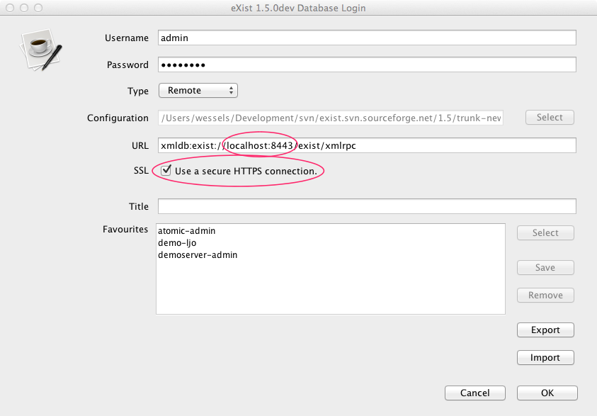
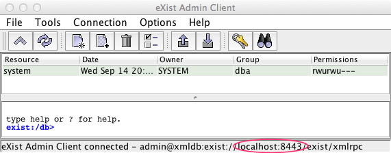

## Java Client

Connecting via HTTPS using the Java client is easy; start the client (using the client.sh or client.bat scripts, or via the WebStart button), the following window appears:

Select Type="Remote", click the SSL checkbox and verify the URL: it might change from 8080 (HTTP) to 8443 (HTTPS). The URL must start with . Enter your username and password, and click OK. Now the client connects to the server :

In the statusbar of the window the connection URL is visible. In this example the client is connected to the HTTPS port 8443.

## XMLDB

For XMLDB only two steps must be made:

1.  Change the URL to contain the HTTPS port (here: 8443)
2.  Set the database property "ssl-enable" to true

A working example:

import javax.xml.transform.OutputKeys; import org.exist.storage.serializers.EXistOutputKeys; import org.exist.xmldb.EXistResource; import org.xmldb.api.DatabaseManager; import org.xmldb.api.base.Collection; import org.xmldb.api.base.Database; import org.xmldb.api.modules.XMLResource; String collection = "xmldb:exist://localhost:8443/exist/xmlrpc/db"; String document = "document.xml"; // Initialize database driver Class&lt;?&gt; cl = Class.forName("org.exist.xmldb.DatabaseImpl"); Database database = (Database) cl.newInstance(); // Switch-on SSL for the driver database.setProperty("ssl-enable", "true"); // Register database DatabaseManager.registerDatabase(database); // Get reference to the collection Collection col = DatabaseManager.getCollection(collection); col.setProperty(OutputKeys.INDENT, "yes"); col.setProperty(EXistOutputKeys.EXPAND\_XINCLUDES, "no"); col.setProperty(EXistOutputKeys.PROCESS\_XSL\_PI, "yes"); XMLResource res = (XMLResource) col.getResource(document); if (res == null) { System.out.println("document not found!"); } else { System.out.println(res.getContent()); }

## XMLRPC

Connecting with XMLRPC has always been possible, but a trick is required to make Java accept self-signed SSL certificates. The XMLRPC project [wrote an article](https://ws.apache.org/xmlrpc/ssl.html) how to do this.

As a concenience the class org.exist.util.SSLHelper has been created to do this trick for you. The following example shows how to retrieve a document:

import java.util.Vector; import java.util.HashMap; import java.net.URL; import org.apache.xmlrpc.client.XmlRpcClient; import org.apache.xmlrpc.client.XmlRpcClientConfigImpl; import org.exist.util.SSLHelper; String uri = "https://localhost:8443/exist/xmlrpc"; String documentPath = "/db/document.xml"; // Initialize HTTPS connection to accept selfsigned certificates // and the Hostname is not validated SSLHelper.initialize(); // Setup XMLRPC XmlRpcClient client = new XmlRpcClient(); XmlRpcClientConfigImpl config = new XmlRpcClientConfigImpl(); config.setServerURL(new URL(uri)); config.setBasicUserName("guest"); config.setBasicPassword("guest"); client.setConfig(config); // Setup options HashMap&lt;String, String&gt; options = new HashMap&lt;String, String&gt;(); options.put("indent", "yes"); options.put("encoding", "UTF-8"); options.put("expand-xincludes", "yes"); options.put("process-xsl-pi", "no"); // Setup request parameters Vector&lt;Object&gt; params = new Vector&lt;Object&gt;(); params.addElement( documentPath ); params.addElement( options ); // Execute String xml = (String) client.execute( "getDocumentAsString", params ); System.out.println( xml );

## Client command line

When the client is started as `client.sh -s` it reads the file `client.properties`. Uncomment the following lines to enable the SSL secured connection :

\## Secure XMLRPC (HTTPS) \#uri=xmldb:exist://localhost:8443/exist/xmlrpc \#ssl-enable=true

## Java stack traces

Connecting to a HTTPS server is complicated, errors can appear. A typical message is show below. The message means that a client tries to connect with SSL to the server, but the server (on a specific URL) is not SSL enabled.

- org.xmldb.api.base.XMLDBException: Failed to read server's response: Unrecognized SSL message, plaintext connection?
- org.apache.xmlrpc.XmlRpcException: Failed to read server's response: Unrecognized SSL message, plaintext connection?
- javax.net.ssl.SSLException: Unrecognized SSL message, plaintext connection