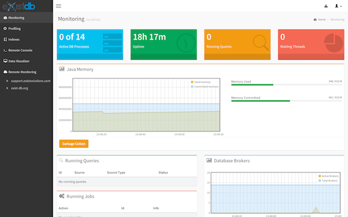

<figure class="wysiwyg-float-right">

<figcaption>New Monitoring and Profiling Interface</figcaption>
</figure>

eXist Solutions GmbH today released eXist LTS version 2.1.6. Since the introduction of Long Term Support (LTS) in January 2014 this is already the 6th quality release of cherry-picked improvements. LTS releases contain all important fixes and enhancements from the develop branch of eXist while maintaining full backwards compatibility within the 2.1 production-ready branch. 

eXist LTS addresses the needs of enterprise-scale users that require a reliable and supported version of the open source version. With LTS, customers can easily stay up to date without taking the risk of building from the development branch, which may break existing code or introduce untested features.

Apart from various bug fixes, LTS 2.1.6 focuses on query performance and improvements to the backup system. 

eXist LTS is available as a subscription at <http://exist-db.org>. Subscribers may download version 2.1.6 from the [Customer Portal](https://support.existsolutions.com/exist/apps/subscription/portal/index.xhtml).